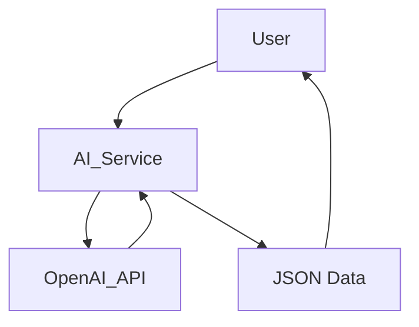

Plan for MVP: AI-assisted UI Automation Platform

Executive Summary
This document outlines a minimal viable plan to build an online platform that allows users to create Projects for UI automation, select among Selenium, Playwright, and Cypress, generate AI-assisted code, and run tests inside a Dockerized environment. Project data is stored in JSON files. A simple in-browser IDE will enable editing and saving files.

MVP Scope

- Backend: Node.js + Express + TypeScript
- Frontend: React + TypeScript
- Data storage: JSON files in data/
- Orchestration: Docker Compose
- AI integration: OpenAI API using OPENAI_API_KEY from environment

Tech Stack

- Backend: Node.js (14+), Express, TypeScript
- Frontend: React, TypeScript
- Data: JSON (plan in data/)
- Tests: Dockerized test runner including Selenium, Playwright, Cypress
- Auth: Basic token-based scaffolding for MVP

Data Model (JSON)
Projects

- id: string
- name: string
- description: string
- tooling: [Selenium, Playwright, Cypress]
- languages: [Java, C#, Python, Ruby, JavaScript, TypeScript]
- createdAt: string
- updatedAt: string
- files: [{ path: string, content: string }]

Users

- id: string
- name: string
- email: string
- role: string

Runs

- id: string
- projectId: string
- startedAt: string
- endedAt: string
- status: string
- results: string

API Design (MVP)
Backend endpoints (Express):

- GET /api/projects
- POST /api/projects
- GET /api/projects/:id
- PUT /api/projects/:id
- DELETE /api/projects/:id
- GET /api/projects/:id/files (list)
- GET /api/projects/:id/files/:path (read)
- PUT /api/projects/:id/files/:path (save/edit)
- DELETE /api/projects/:id/files/:path (delete)
- POST /api/ai/generate-code (AI generation)
- GET /api/runs
- POST /api/runs (start run)

AI Workflow

- Client requests AI-generated code for a given project and tool
- Server builds a structured prompt including project context and tool mapping
- OpenAI API returns generated code
- Generated code is stored in data/ projects under the appropriate file path

Frontend Prototype

- Minimal IDE: tree view of files, editor pane, save, delete actions
- Project listing and creation screen
- Trigger AI code generation and view AI results in editor

Dockerization

- Backend Dockerfile
- Frontend Dockerfile or shared container approach
- docker-compose.yaml to run app and a test runner container with Selenium/Playwright/Cypress

Repository Layout

- backend/
- frontend/
- data/
- docker-compose.yaml
- plan.md
- README.md

Milestones (execution order)

- Create plan.md, data folder
- Implement backend API scaffold
- Integrate AI endpoint (OpenAI)
- Build frontend skeleton
- Add Docker Compose
- Implement user scaffolding and runs API
- Documentation and run instructions

Risks

- AI token usage and cost
- JSON consistency and concurrency
- Security of API endpoints

Run instructions

- Steps to run locally (node, npm/yarn)
- How to configure OPENAI_API_KEY

Environment Configuration
For local development we separate backend and frontend environment variables. Copy `.env.example` to the correct places:

1. Backend (`backend/.env`):

- PORT=3000 (or another free port)
- OPENAI_API_KEY=sk-... (your real key)
- OPENAI_MODEL=gpt-4o-mini (override if desired)

2. Frontend (`frontend/.env.local`):

- NEXT_PUBLIC_BACKEND_URL=http://localhost:3000 (must match backend PORT)

Why NEXT_PUBLIC_BACKEND_URL?
The frontend now calls the Express AI endpoints directly (e.g. `${NEXT_PUBLIC_BACKEND_URL}/api/ai/generate-code`). Without this, it would attempt to call a non-existent Next.js API route and return a 404 HTML page.

Quick Start

```
# Terminal 1 (backend)
cd backend
cp ../.env.example .env   # or create manually
npm install
npm run dev

# Terminal 2 (frontend)
cd frontend
cp ../.env.example .env.local   # keep only NEXT_PUBLIC_* entries if you prefer
npm install
npm run dev
```

Open http://localhost:3001 (Next.js dev port) in the browser. The AI Assistant and IDE panels will use the configured backend URL.

Security Notes

- Never commit real OPENAI_API_KEY values.
- Any variable prefixed with NEXT*PUBLIC* becomes part of the client bundle; do not expose secrets there.

Reference

- Plan located at plan.md
- Link: [`plan.md`](plan.md:1)

Mermaid diagram (data flow)


